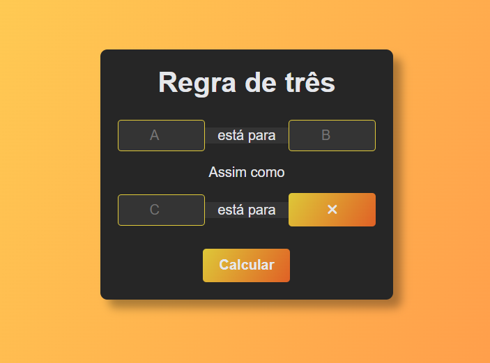

# Calculadora de Regra de Três Simples

Este repositório contém uma calculadora de **Regra de Três Simples** desenvolvida em HTML, CSS e JavaScript. A calculadora permite calcular a quarta variável em uma proporção diretamente proporcional entre três valores conhecidos. A interface é simples e intuitiva, tornando fácil o cálculo de proporções.

## Layout

Aqui está como o projeto fica visualmente:



## Como Usar

1. Clone ou faça o download deste repositório:
    ```bash
    git clone https://github.com/mikaelmora1s/regra_de_tres_basico.git
    ```
2. Abra o arquivo `index.html` no seu navegador.

## Funcionalidades

- Insira os valores nas caixas de entrada **A**, **B** e **C**.
- Clique no botão **Calcular** para obter o resultado da proporção.
- O resultado será exibido na caixa de resultado.

## Tecnologias Utilizadas

- **HTML**: Linguagem de marcação para estruturar a página da calculadora.
- **CSS**: Estilização para criar uma interface atraente e responsiva.
- **JavaScript**: Lógica para realizar o cálculo da proporção e exibir o resultado.

## Estilos e Personalização

O arquivo `styles.css` contém os estilos utilizados na calculadora. Você pode personalizar as cores, fontes e outros elementos visuais modificando as variáveis no arquivo.

## Contribuição

Se você quiser contribuir para este projeto, fique à vontade para fazer um fork, criar um branch e enviar um pull request com suas melhorias.

## Autor

Este projeto foi desenvolvido por **Mikael Morais**.
